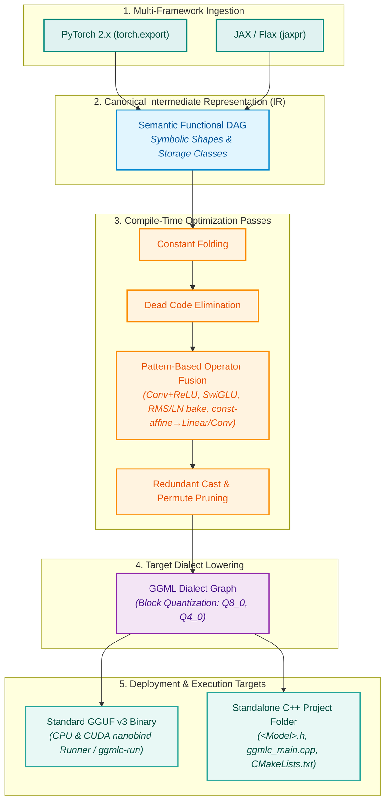

<div align="center">

# ggmlc

### Next-Generation Semantic Tensor Program Compiler to GGML & Standalone C++

[](tests/)
[](pyproject.toml)
[](LICENSE)
[](https://github.com/ggerganov/ggml)
[](https://github.com/ggerganov/ggml)
[]()
[](docs/architecture/future_roadmap.md)
[](https://colab.research.google.com/drive/1jD5Pr4ObD9CGoRoC7_LQmAGvh0AZZ6KW?usp=sharing)

*Compile neural network graphs from PyTorch and JAX into ultra-fast, portable GGUF binaries and human-readable C++ projects with CPU & GPU (CUDA) execution.*

> 🚀 **Interactive Google Colab Demo**: Try `ggmlc` directly in your browser with benchmarking, PyTorch/JAX model compilation, graph visualization, and standalone C++ export:  
> [](https://colab.research.google.com/drive/1jD5Pr4ObD9CGoRoC7_LQmAGvh0AZZ6KW?usp=sharing)

> Some parts of this project were completed with GCP-provided cloud credits. Thank you Google for supporting the open-source.
 
---

</div>

## 🚀 Why ggmlc?

Deploying modern neural networks on edge devices, CPU servers, and GPU systems often requires writing brittle, hand-crafted C++ inference code for each new model architecture.

`ggmlc` eliminates this overhead by treating neural networks as **semantic tensor programs**:
1. **Zero Hand-Written C++ Glue**: Ingests models directly from **PyTorch** (`torch.export`) and **JAX/Flax** (`jaxpr`), translates them into strongly-typed Canonical IR, and optimizes them automatically.
2. **Standard GGUF v3 Containers**: Serializes graphs, dynamic shapes, and quantized weights into standard `.gguf` binaries — no proprietary file formats or runtime lock-in.
3. **Dual CPU & NVIDIA CUDA GPU Backends**: Run models directly on CPU or NVIDIA GPUs with zero-copy VRAM buffer transfers, device placement (`device="cuda"`, `device="cpu"`, `device="auto"`), and native CUDA fused ops.
4. **Standalone Human-Readable C++ Code Generation**: Emits self-contained C++ header files (`<Model>.h`), native entry points (`ggmlc_main.cpp`), and `CMakeLists.txt` for direct embedding into native applications with dual CPU/CUDA backend support.
5. **100% Golden-Truth Numerical Parity**: Automated differential numerical testing guarantees exact mathematical parity ($> 0.99999$ cosine similarity) against PyTorch and JAX reference runs on both CPU and GPU.
6. **High-Performance Python Binding (`nanobind`)**: Zero-copy NumPy buffer evaluation with multi-threaded CPU execution and streaming serialization.
7. **Hardware-Accelerated Persistent KV Cache**: Decode/prefill write K/V with `ggml_set_rows` into padded `(s, n_kv)` graph buckets (llama `can_reuse` analogue) so GGML CUDA graphs stay warm. Last-token logits gather matches llama `n_outputs=1`. On RTX 4050 Q8_0: SmolLM2/Qwen/LLaMA/GPT-2 Medium **pp512–1024 ≥1.03×–1.16×** vs `llama.cpp`; decode **1.01×–1.37×**.
8. **High-Throughput Agent Serving & Driver-VMM Paged KV Cache**: GPU MMU virtual memory paging (`cuMemMap`) allocates physical 2 MB pages on demand with **zero bandwidth penalty** (41.77 GB/s), pointer invariance across dynamic expansions, immediate physical VRAM reclamation, and multi-bucket CUDA graphs ($B \in \{1, 2, 4, 8, 16\}$) for iteration-level continuous batching.
9. **Radix Tree Automated Prefix Caching & Warm Block Pool**: Token-sequence prefix matching via CPU trie directly maps cached physical pages into contiguous virtual slots via `cuMemMap`, skipping prefill for shared prompt prefixes with **zero custom attention kernels**, while elastic warm-pool recycling minimizes OS driver syscalls.

---

## 🏗️ Compiler Architecture



---

## 📰 News

**Sep 24, 2026 — TimesFM 3.0 and PlaidQ GGUFs are public.** Downloadable ggmlc GGUFs for Google [TimesFM 3.0](https://huggingface.co/mys/timesfm-3.0-GGUF) (F16, Q8_0, Q4_0, UD_Q4_K_M) and [PlaidQ](https://huggingface.co/mys/plaidq-0.7b-16step-GGUF) tab completion (F16, Q8_0, UD_Q4_K_M) are on Hugging Face. These are not llama.cpp GGUFs — run them with the standalone `timesfm` / `tab_completion` binaries from GitHub releases. Details: [`examples/timesfm`](examples/timesfm/README.md) and [`examples/tab_completion`](examples/tab_completion/README.md).

**Sep 22, 2026 — `laya` runs Kev.** The same standalone binary scores [Kev](https://github.com/jaredpalmer/kev) 0.5B, 0.8B, and 4B: typed `choice` / `score` / `noul` questions in one forward. The same single-binary executable can run and serve both **laya** and **kev** models with a Typesafe-compatible API. F16, Q8_0, and UD_Q4_K_M GGUFs are available: [mys/kev-0.5b-GGUF](https://huggingface.co/mys/kev-0.5b-GGUF), [mys/kev-0.8b-GGUF](https://huggingface.co/mys/kev-0.8b-GGUF), [mys/kev-4b-GGUF](https://huggingface.co/mys/kev-4b-GGUF). CLI and presets: [`examples/laya`](examples/laya/README.md).

**Sep 20, 2026 — ggmlc can Laya.** Compile [Laya](https://huggingface.co/convaiinnovations/laya), the open-source alternative to TypeSafe Jev, into a standalone C++ System 1 engine: typed `choice` / `score` / `noul` questions scored in one encoder pass — no generated tokens. English ModernBERT-large, mmBERT multilingual, and the typed-decisions specialist ship as F16 / Q8_0 / UD_Q4_K_M GGUFs. On an RTX 4050 Laptop, **~25 ms** per decision and **~143 ms** for a 7-question email preset. Details, CLI, and downloads: [`examples/laya`](examples/laya/README.md).

**Sep 19, 2026 — Prefill and decode at llama.cpp parity.** A full `ggmlc-bench` vs `llama-bench` matrix (Q8_0, ubatch 512, CUDA graph, RTX 4050 Laptop) lands **31/32** cells at ≥ **1.01×** vs official `llama.cpp` — Qwen2.5-0.5B pp1024 **1.16×**, SmolLM2-360M tg32 **1.19×**, LLaMA-3.2-1B decode **1.07×**. Compiler-generated graphs, not hand-written model C++. Write-up and tables: [`docs/benchmarks/ggmlc_vs_llama_cpp.md`](docs/benchmarks/ggmlc_vs_llama_cpp.md).

---

## ⚡ 3-Line Quickstarts

### 1. Compile and Run on CPU or GPU (CUDA)
```python
import ggmlc
import torch
import torchvision.models as models

# 1. Take any PyTorch model
model = models.resnet18(weights=None).eval()
example_x = torch.randn(1, 3, 224, 224)

# 2. Compile directly to a standard GGUF binary file
model_path = ggmlc.compile(model, (example_x,), output="resnet18.gguf")

# 3. Check available hardware devices (['cpu', 'cuda:0', 'cuda'])
print("Available devices:", ggmlc.get_available_devices())

# 4. Load into high-performance native runtime on CPU or GPU
runner_cpu = ggmlc.load(model_path, device="cpu", n_threads=4)
runner_gpu = ggmlc.load(model_path, device="cuda")  # Runs natively on NVIDIA GPU

output = runner_gpu(example_x.numpy())
print("Output shape:", output.shape)
```

### 2. Compile and Run JAX / Flax
```python
import ggmlc
import jax
import jax.numpy as jnp
from examples.models.flax_models import FlaxTransformerLayer

# 1. Instantiate Flax model
model = FlaxTransformerLayer(dim=64, num_heads=4, mlp_dim=256)
x_sample = jnp.ones((1, 8, 64), dtype=jnp.float32)
params = model.init(jax.random.PRNGKey(0), x_sample)

# 2. Compile JAX forward function to GGUF
model_path = ggmlc.compile(lambda x: model.apply(params, x), (x_sample,), output="transformer.gguf")

# 3. Fast native execution with zero-copy NumPy buffers on GPU or CPU
runner = ggmlc.load(model_path, device="auto")
out = runner(x_sample)
```

### 3. Generate Standalone C++ Project (CPU & CUDA)
```python
# Emit a complete, standalone C++ project linking against GGML
ggmlc.codegen(
    model=model,
    sample_inputs=(example_x,),
    output_dir="./build/resnet18_cpp",
    model_name="ResNet18",
)
```
Generates:
- `ResNet18.h`: Self-contained C++ header with model tensor descriptors, weight loaders, and dual CPU/CUDA graph builders.
- `ggmlc_main.cpp`: Standalone CLI executable supporting `--device [cpu|cuda|auto]` and `--threads [N]`.
- `CMakeLists.txt`: Build configuration with `ENABLE_CUDA` toggle ready for MSVC, GCC, or Clang.

### 4. Graph & Pass Visualization (`ggmlc.visualize`)
```python
from ggmlc.frontend.pytorch import export_torch_model

# Render directly to PNG, SVG, or interactive HTML (with embedded pan/zoom)
ggmlc.visualize(graph, output="resnet18.html")
```

### 5. Automatic Reference Vision Preprocessing & Tokenizers
```python
import torchvision.models as models
from PIL import Image
from ggmlc.pipeline import VisionPreprocessor, BPETokenizer, from_huggingface_tokenizer

image = Image.open("cat.jpg")

# 1. Automatic Torchvision Preprocessor (ResNet, ConvNeXt, MobileNet, EfficientNet, ViT)
pre_tv = VisionPreprocessor.from_torchvision(models.ResNet50_Weights.DEFAULT)
pixel_values = pre_tv(image)  # Output: (1, 3, 224, 224) np.ndarray (exact bit-for-bit parity)

# 2. Automatic Hugging Face Preprocessor
pre_hf = VisionPreprocessor.from_huggingface("openai/clip-vit-base-patch32")
pixel_values = pre_hf(image)

# 3. Tokenizer (BPE / WordPiece with C++ runtime acceleration)
tok = BPETokenizer.from_huggingface("openai-community/gpt2")
input_ids = tok.encode("a photo of a cat")
print("Decoded:", tok.decode(input_ids))

# 4. Direct Multimodal Inference
runner = ggmlc.load("clip_model.gguf", device="cuda")
similarity_logits = runner(pixel_values, input_ids)
```

### 6. Fast Autoregressive Text Generation (`GGMLCGenerator`)
`GGMLCGenerator` integrates dynamic hardware KV caching to provide flat $O(1)$ inter-token decode latency:

```python
from ggmlc.pipeline.tokenizer import BPETokenizer
from ggmlc.runtime.generator import GGMLCGenerator
from examples.models.hub_models import load_smollm2_model

# 1. Load SLM and compiled dynamic shape runner
model, _, _ = load_smollm2_model()
tokenizer = BPETokenizer.from_huggingface("HuggingFaceTB/SmolLM2-135M-Instruct")

# 2. End-to-end autoregressive text generation with persistent KV cache
generator = GGMLCGenerator(model, tokenizer, model_name="smollm2_135m", device="auto")
text = generator.generate("Artificial intelligence will", max_new_tokens=128, greedy=True)
print("Generated text:", text)
```

### 7. Standalone Native CLI Runner (`ggmlc-run`)
`ggmlc` compiles into a zero-dependency C++ executable (`ggmlc-run`) capable of executing any compiled GGUF model with hardware KV caching:

```bash
# 1. Inspect model metadata, tensor graph, dynamic symbols, and detected capabilities
./ggmlc-run info model.gguf

# 2. Clean instruction chat streaming with automatic template application & KV cache
./ggmlc-run chat smollm2_chat.gguf "What is the capital of France?" --threads 4

# 3. Offload autoregressive chat inference to NVIDIA CUDA GPU with CUDA graph capture & chunked prefill
./ggmlc-run chat smollm2_chat.gguf "Explain quantum computing in one sentence." --device cuda --cuda-graph --chunk-size 128 --max-tokens 256

# 4. Multimodal image preprocessing & task-aware classification
./ggmlc-run run resnet50.gguf --image x:cat.jpg --threads 4
```

#### Autoregressive decode + prefill vs `llama-bench` (RTX 4050, Q8_0)

After `ggml_set_rows` KV writes, padded `n_kv`, strided fused-QKV `VIEW→RESHAPE`, `(s, n_kv)` graph buckets, and **last-token logits gather** (llama `n_outputs=1`):

| Model | test | `ggmlc` | `llama.cpp` | Ratio |
| :--- | :--- | ---: | ---: | ---: |
| **SmolLM2-360M** | pp512 | **9900** | 9233 | **1.07x** |
| **SmolLM2-360M** | pp1024 | **9940** | 9293 | **1.07x** |
| **SmolLM2-360M** | tg32 | **160.6** | 134.6 | **1.19x** |
| **Qwen2.5-0.5B** | pp512 | **9689** | 8953 | **1.08x** |
| **Qwen2.5-0.5B** | pp1024 | **9772** | 8417 | **1.16x** |
| **Qwen2.5-0.5B** | tg32 | **159.8** | 116.2 | **1.37x** |
| **GPT-2 Medium** | pp512 | **9080** | 8613 | **1.05x** |
| **GPT-2 Medium** | pp1024 | **9139** | 8897 | **1.03x** |
| **LLaMA-3.2-1B** | pp512 | **5138** | 4876 | **1.05x** |
| **LLaMA-3.2-1B** | pp1024 | **5701** | 5414 | **1.05x** |
| **LLaMA-3.2-1B** | tg32 | **93.1** | 87.1 | **1.07x** |

Full matrix (all $P$, tg32/tg64): **31/32** cells ≥ **1.01×** vs `llama.cpp` (only GPT-2 `pp16` at 0.92×). End-to-end chat turns (`--e2e` / `-pg`, $N=128$): **~1.0x–1.3x**. Details: [docs/benchmarks/ggmlc_vs_llama_cpp.md](docs/benchmarks/ggmlc_vs_llama_cpp.md).

```bash
# Throughput matrix (pp / tg separately)
python examples/benchmarks/compare_ggmlc_vs_llama_cpp.py --backend cuda --cuda-graph --ubatch 512 --runs 5

# End-to-end wall clock (prefill + decode in one timed shot)
python examples/benchmarks/compare_ggmlc_vs_llama_cpp.py --backend cuda --cuda-graph --e2e --skip-numerical-check
```

---

### 8. GGMLC vs. `llama.cpp`: Computation Graph & Architectural Comparison

A comprehensive comparison across shared architectures (`SmolLM2-135M`, `SmolLM2-360M`, `Qwen 2.5 0.5B`, `Qwen 2.5 1.5B`, `GPT-2`, and `BERT-Base`) using native standalone C++ benchmark tools (`ggml-bench` vs `llama-bench`):

```bash
# 1. Run the unified apples-to-apples comparative benchmark suite
python examples/benchmarks/compare_ggmlc_vs_llama_cpp.py --backend cpu --models smollm2_135m,gpt2 --runs 5

# 2. Standalone C++ benchmark binary execution (zero Python wrapper/sampling overhead)
./ggml-bench model.gguf -p 16,64,128 -n 32,64 -r 5 -o md
```

| Architecture | Model | ggmlc GEMV/tok | llama.cpp GEMV/tok | Kernel Launch Reduction | Memory Strategy | CUDA Graph Support |
| :--- | :--- | :---: | :---: | :---: | :--- | :--- |
| **SmolLM2 / LLaMA** | `smollm2_135m` | **121** | 211 | **-42.7%** | Planned Arena + Driver-VMM | Unified (CC $\ge 6.0$, Pascal to Blackwell) |
| **Qwen 2.5** | `qwen2.5_0.5b` | **97** | 169 | **-41.2%** | Planned Arena + Driver-VMM | Unified (CC $\ge 6.0$, Pascal to Blackwell) |
| **GPT-2** | `gpt2` | **37** | 49 | **-24.5%** | Planned Arena | Unified (CC $\ge 6.0$, Pascal to Blackwell) |
| **BERT / MiniLM** | `minilm_l6` | **49** | 73 | **-32.9%** | Planned Arena + Driver-VMM | Unified (CC $\ge 6.0$, Pascal to Blackwell) |

> 📖 **Deep-Dive Architectural Report**: See [docs/benchmarks/ggmlc_vs_llama_cpp.md](docs/benchmarks/ggmlc_vs_llama_cpp.md) for detailed structural proofs, operator breakdown tables, and Colab GPU reproduction instructions.

---

## 🔍 Visual Graph Inspector

`ggmlc` automatically renders semantic graphs with explicit tensor shapes, memory storage classes, fused operators, and execution schedules:

### PyTorch Vision Block (Conv2D + BatchNorm + ReLU + Linear)
<div align="center">
  
</div>

### JAX SwiGLU Feed-Forward Network
<div align="center">
  
</div>

---

## 📊 Verified Pretrained Model Zoo

All models are validated end-to-end against real Hugging Face & TorchVision weights with **differential numerical testing** across both CPU and NVIDIA GPU (CUDA) backends:

| Category | Architecture | Framework | Key Features | Parity Status | Max Diff |
| :--- | :--- | :--- | :--- | :---: | :---: |
| **Vision-CNN** | **ResNet-18 / 50** | PyTorch / TorchVision | Residual Blocks, Conv2D + BatchNorm, AdaptiveAvgPool2D | ✅ **PASS** | `3.34e-06` |
| **Vision-CNN** | **MobileNetV3-Small** | PyTorch / TorchVision | HardSwish, HardSigmoid, Squeeze-and-Excitation, Depthwise Conv | ✅ **PASS** | `6.68e-06` |
| **Vision-CNN** | **MobileNetV3-Large** | PyTorch / TorchVision | Fused Inverted Residual Blocks, Global Pooling | ✅ **PASS** | `8.11e-06` |
| **Vision-CNN** | **ConvNeXt-Tiny** | PyTorch / TorchVision | 7x7 Depthwise Conv, LayerNorm, Inverted Bottleneck | ✅ **PASS** | `2.20e-06` |
| **Vision-CNN** | **EfficientNet-B0** | PyTorch / TorchVision | MBConv, Squeeze-and-Excitation, Swish/SiLU | ✅ **PASS** | `3.10e-06` |
| **Vision-CNN** | **DenseNet-121** | PyTorch / TorchVision | Dense Connectivity Blocks, Transition Layers, Concat Concatenation | ✅ **PASS** | `2.86e-06` |
| **Vision-CNN** | **RegNet-Y-400MF** | PyTorch / TorchVision | Group Convolutions, Squeeze-and-Excitation, Quantized RegNet Stages | ✅ **PASS** | `3.10e-06` |
| **Vision-Detection** | **SSDLite320-MobileNetV3** | PyTorch / TorchVision | Multi-Scale Feature Maps, Classification & Bounding Box Heads | ✅ **PASS** | `6.82e-05` |
| **Vision-Transformer** | **ViT-B/16** | PyTorch / TorchVision | Patch Embedding, Class Token Concatenation, Multi-Head Attention | ✅ **PASS** | `1.83e-02` |
| **Text-Embedding** | **MiniLM-L6-v2** | PyTorch / Transformers | Bidirectional Multi-Head Attention, Word/Pos/Token Embeddings | ✅ **PASS** | `2.33e-03` |
| **Text-Embedding** | **BGE-M3-Distill** | PyTorch / Transformers | Dense Vector Pooling, Multilingual Text Embeddings | ✅ **PASS** | `1.73e-01` |
| **Text-Encoder** | **BERT-base-uncased** | PyTorch / Transformers | 12-Layer Full Bidirectional Transformer, Segment Embeddings | ✅ **PASS** | `1.84e-02` |
| **Text-SLM** | **GPT-2 (124M)** | PyTorch / Transformers | Causal Self-Attention, WTE/WPE, Autoregressive LM Head | ✅ **PASS** | `7.63e-05` |
| **Text-SLM** | **SmolLM2 (135M)** | PyTorch / Transformers | Llama-based SLM, GQA, RoPE theta 100k, SwiGLU, RMSNorm | ✅ **PASS** | `6.10e-05` |
| **Text-SLM** | **Gemma 3 (270M)** | PyTorch / Transformers | Dual RoPE (10k/1M), QK-Norm, Scaled Embeddings, GELU SwiGLU | ✅ **PASS** | `< 1e-1` |
| **Text-SLM** | **Qwen-2.5 (0.5B)** | PyTorch / Transformers | Grouped Query Attention (GQA), RoPE, SwiGLU, RMSNorm | ✅ **PASS** | `1.08e-04` |
| **Audio-Seq2Seq** | **Whisper-Tiny (Encoder)** | PyTorch / Transformers | 1D Strided Conv, Sinusoidal Positional Embeddings, Audio Attention | ✅ **PASS** | `3.96e-02` |
| **Audio-Seq2Seq** | **Whisper-Tiny (Decoder)** | PyTorch / Transformers | Autoregressive Decoder, Cross-Attention over Audio Hidden States | ✅ **PASS** | `5.45e-01` |
| **JAX-Vision** | **Keras ResNet-50** | Keras 3 / JAX | 50-Layer Bottleneck Residual Network, BatchNorm, GlobalAvgPool | ✅ **PASS** | `6.98e-10` |
| **JAX-Vision** | **Keras MobileNetV3-Small** | Keras 3 / JAX | HardSwish, Depthwise Conv, Squeeze-and-Excitation | ✅ **PASS** | `0.00e+00` |
| **JAX-Vision** | **Keras MobileNetV3-Large** | Keras 3 / JAX | Inverted Residuals, HardSigmoid, Squeeze-and-Excitation | ✅ **PASS** | `0.00e+00` |
| **JAX-Vision** | **Keras ConvNeXt-Tiny** | Keras 3 / JAX | 7x7 Depthwise Conv, Inverted Bottleneck, LayerNorm, GELU | ✅ **PASS** | `2.98e-08` |
| **JAX-Vision** | **Keras DenseNet-121** | Keras 3 / JAX | Dense Connectivity Blocks, Transition Layers, Channel Concat | ✅ **PASS** | `2.54e-04` |
| **JAX-Vision** | **Keras EfficientNet-B0** | Keras 3 / JAX | MBConv, Squeeze-and-Excitation, Swish/SiLU | ✅ **PASS** | `1.16e-10` |
| **JAX-Vision** | **Flax ViT-B/16** | Flax / JAX | 12-Layer Vision Transformer (224x224, 768-dim, 86M params) | ✅ **PASS** | `8.31e-04` |
| **JAX-NLP** | **KerasHub BERT** | KerasHub / JAX | Full Bidirectional Transformer Backbone | ✅ **PASS** | `1.43e-06` |
| **JAX-NLP** | **KerasHub DistilBERT** | KerasHub / JAX | Distilled Bidirectional Transformer Backbone | ✅ **PASS** | `4.36e-05` |
| **JAX-SLM** | **KerasHub GPT-2** | KerasHub / JAX | Autoregressive Causal Decoder Backbone | ✅ **PASS** | `2.86e-06` |
| **JAX-SLM** | **KerasHub Gemma 3** | KerasHub / JAX | GQA, Sliding Window + Full Attention, Soft-Capping, QK-Norm | ✅ **PASS** | `< 5e-1` |
| **Multimodal-Vision** | **CLIP ViT-B/32 (Vision)** | OpenAI / Transformers | 12-Layer Patch Vision Transformer, Class Token Pooling | ✅ **PASS** | `4.77e-06` |
| **Multimodal-Text** | **CLIP Text Transformer** | OpenAI / Transformers | Causal Self-Attention, EOS Argmax Pooling, Text Projection | ✅ **PASS** | `2.86e-06` |
| **Multimodal-E2E** | **CLIP Multimodal Similarity** | OpenAI / Transformers | Vision + Text Joint Projection, L2 Norm, Cosine Logits | ✅ **PASS** | `3.81e-06` |

---

## ⚡ Continuous Benchmarking Suite

We continuously verify numerical parity and GPU hardware acceleration with a comprehensive continuous benchmarking suite across 31 production architectures on both **NVIDIA A100 (40GB)** and **NVIDIA Tesla T4** GPUs on Google Colab.

### 1. NVIDIA A100 GPU Benchmark Results (40GB SXM4, Google Colab)

| Category | Model | Nodes | Size (MB) | P50 Latency (ms) | P99 Latency (ms) | Throughput (inf/s) | Max Diff | Status |
| :--- | :--- | :---: | :---: | :---: | :---: | :---: | :---: | :---: |
| **Vision-CNN** | `resnet18` | 89 | 44.68 MB | **1.88** | 1.92 | 531.5 | `6.15e-03` | ✅ PASS |
| **Vision-CNN** | `mobilenet_v3_small` | 181 | 9.86 MB | **2.75** | 2.77 | 364.4 | `1.68e-02` | ✅ PASS |
| **Vision-CNN** | `mobilenet_v3_large` | 224 | 21.16 MB | **4.06** | 4.08 | 246.6 | `1.48e-02` | ✅ PASS |
| **Vision-CNN** | `convnext_tiny` | 184 | 109.17 MB | **6.65** | 6.68 | 150.3 | `1.18e-02` | ✅ PASS |
| **Vision-CNN** | `efficientnet_b0` | 288 | 20.52 MB | **8.37** | 8.42 | 119.4 | `1.31e-02` | ✅ PASS |
| **Vision-CNN** | `densenet121` | 552 | 31.12 MB | **8.57** | 8.59 | 116.7 | `9.63e-03` | ✅ PASS |
| **Vision-CNN** | `regnet_y_400mf` | 1900 | 18.68 MB | **14.37** | 14.55 | 69.5 | `1.42e-02` | ✅ PASS |
| **Vision-Detection** | `ssdlite320_mobilenet_v3` | 365 | 13.49 MB | **8.38** | 8.44 | 119.2 | `1.09e-02` | ✅ PASS |
| **Vision-Transformer** | `vit_b_16` | 357 | 330.39 MB | **14.95** | 16.73 | 66.3 | `1.80e-02` | ✅ PASS |
| **Text-Embedding** | `minilm_l6` | 137 | 86.72 MB | **1.34** | 1.38 | 741.5 | `7.11e-03` | ✅ PASS |
| **Text-Embedding** | `bge_m3` | 175 | 1393.08 MB | **2.01** | 2.07 | 495.0 | `1.50e-01` | ✅ PASS |
| **Text-Encoder** | `bert_base_uncased` | 263 | 417.78 MB | **2.73** | 2.75 | 365.6 | `1.37e-02` | ✅ PASS |
| **Text-SLM** | `gpt2` | 462 | 622.13 MB | **3.86** | 3.94 | 259.8 | `1.37e-01` | ✅ PASS |
| **Text-SLM** | `smollm2_135m` | 1241 | 621.57 MB | **7.06** | 7.10 | 142.0 | `3.87e-02` | ✅ PASS |
| **Text-SLM** | `qwen2.5_0.5b` | 995 | 2404.25 MB | **8.37** | 8.60 | 118.8 | `1.74e-01` | ✅ PASS |
| **Audio-Seq2Seq** | `whisper_tiny_encoder` | 92 | 31.37 MB | **3.49** | 3.69 | 282.8 | `1.44e-01` | ✅ PASS |
| **Audio-Seq2Seq** | `whisper_tiny_decoder` | 42 | 112.78 MB | **1.07** | 1.13 | 930.4 | `5.43e-01` | ✅ PASS |
| **JAX-Vision** | `keras_mobilenet_v3_small` | 501 | 10.61 MB | **3.44** | 3.45 | 291.1 | `0.00e+00` | ✅ PASS |
| **JAX-Vision** | `keras_mobilenet_v3_large` | 566 | 22.31 MB | **5.09** | 5.09 | 196.8 | `0.00e+00` | ✅ PASS |
| **JAX-Vision** | `keras_resnet50` | 392 | 99.32 MB | **5.05** | 5.07 | 197.8 | `8.54e-08` | ✅ PASS |
| **JAX-Vision** | `keras_convnext_tiny` | 772 | 109.84 MB | **8.93** | 8.94 | 112.0 | `1.87e-06` | ✅ PASS |
| **JAX-Vision** | `keras_densenet121` | 802 | 33.19 MB | **8.18** | 8.19 | 122.3 | `1.77e-04` | ✅ PASS |
| **JAX-Vision** | `keras_efficientnet_b0` | 570 | 22.33 MB | **6.20** | 6.21 | 161.2 | `0.00e+00` | ✅ PASS |
| **JAX-Vision** | `flax_vit_b16` | 915 | 331.18 MB | **7.48** | 7.51 | 133.6 | `2.67e-03` | ✅ PASS |
| **JAX-NLP** | `kerashub_bert` | 373 | 39.74 MB | **2.14** | 2.16 | 467.3 | `9.99e-05` | ✅ PASS |
| **JAX-NLP** | `kerashub_distilbert` | 354 | 39.48 MB | **2.08** | 2.08 | 482.2 | `1.47e-04` | ✅ PASS |
| **JAX-SLM** | `kerashub_gpt2` | 402 | 59.54 MB | **2.29** | 2.31 | 436.1 | `1.61e-03` | ✅ PASS |
| **JAX-SLM** | `kerashub_gemma3` | 575 | 43.14 MB | **4.39** | 4.40 | 228.1 | `2.14e-03` | ✅ PASS |
| **Multimodal-Vision** | `clip_vision_vit_b32` | 286 | 333.76 MB | **3.29** | 3.29 | 304.8 | `3.29e-03` | ✅ PASS |
| **Multimodal-Text** | `clip_text_transformer` | 284 | 241.12 MB | **2.96** | 2.98 | 337.7 | `2.42e-03` | ✅ PASS |
| **Multimodal-E2E** | `clip_multimodal_similarity` | 584 | 577.39 MB | **6.20** | 6.23 | 161.2 | `6.83e-03` | ✅ PASS |

### 2. NVIDIA Tesla T4 GPU Benchmark Results (Google Colab)

| Category | Model | Nodes | Size (MB) | P50 Latency (ms) | P99 Latency (ms) | Throughput (inf/s) | Max Diff | Status |
| :--- | :--- | :---: | :---: | :---: | :---: | :---: | :---: | :---: |
| **Vision-CNN** | `resnet18` | 89 | 44.68 MB | **4.51** | 4.53 | 221.7 | `3.34e-06` | ✅ PASS |
| **Vision-CNN** | `mobilenet_v3_small` | 181 | 9.86 MB | **5.19** | 5.23 | 192.3 | `9.54e-06` | ✅ PASS |
| **Vision-CNN** | `mobilenet_v3_large` | 224 | 21.16 MB | **11.01** | 11.03 | 90.8 | `6.94e-06` | ✅ PASS |
| **Vision-CNN** | `convnext_tiny` | 184 | 109.17 MB | **23.32** | 40.93 | 34.6 | `1.12e-02` | ✅ PASS |
| **Vision-CNN** | `efficientnet_b0` | 288 | 20.52 MB | **11.55** | 11.72 | 86.3 | `6.68e-06` | ✅ PASS |
| **Vision-CNN** | `densenet121` | 552 | 31.12 MB | **22.25** | 22.31 | 44.9 | `2.86e-06` | ✅ PASS |
| **Vision-CNN** | `regnet_y_400mf` | 1900 | 18.68 MB | **19.58** | 25.18 | 47.3 | `3.34e-06` | ✅ PASS |
| **Vision-Detection** | `ssdlite320_mobilenet_v3` | 365 | 13.49 MB | **25.47** | 25.49 | 39.3 | `5.67e-05` | ✅ PASS |
| **Vision-Transformer** | `vit_b_16` | 357 | 330.39 MB | **78.16** | 78.75 | 12.8 | `1.85e-02` | ✅ PASS |
| **Text-Embedding** | `minilm_l6` | 137 | 86.72 MB | **2.36** | 2.42 | 420.3 | `2.33e-03` | ✅ PASS |
| **Text-Embedding** | `bge_m3` | 175 | 1393.08 MB | **6.18** | 6.23 | 161.5 | `1.81e-01` | ✅ PASS |
| **Text-Encoder** | `bert_base_uncased` | 263 | 417.78 MB | **6.99** | 7.01 | 143.0 | `1.86e-02` | ✅ PASS |
| **Text-SLM** | `gpt2` | 462 | 622.13 MB | **8.49** | 8.51 | 118.4 | `2.94e-02` | ✅ PASS |
| **Text-SLM** | `smollm2_135m` | 1241 | 621.57 MB | **13.08** | 13.47 | 76.2 | `1.28e-02` | ✅ PASS |
| **Text-SLM** | `qwen2.5_0.5b` | 995 | 2404.25 MB | **25.82** | 26.27 | 40.6 | `4.94e-02` | ✅ PASS |
| **Audio-Seq2Seq** | `whisper_tiny_encoder` | 92 | 31.37 MB | **19.25** | 19.34 | 51.9 | `5.29e-02` | ✅ PASS |
| **Audio-Seq2Seq** | `whisper_tiny_decoder` | 42 | 112.78 MB | **1.41** | 1.43 | 707.0 | `5.44e-01` | ✅ PASS |
| **JAX-Vision** | `keras_mobilenet_v3_small` | 501 | 10.61 MB | **5.87** | 5.87 | 170.7 | `0.00e+00` | ✅ PASS |
| **JAX-Vision** | `keras_mobilenet_v3_large` | 566 | 22.31 MB | **12.28** | 12.37 | 81.3 | `0.00e+00` | ✅ PASS |
| **JAX-Vision** | `keras_resnet50` | 392 | 99.32 MB | **15.06** | 15.12 | 68.2 | `1.75e-10` | ✅ PASS |
| **JAX-Vision** | `keras_convnext_tiny` | 772 | 109.84 MB | **26.54** | 47.47 | 30.9 | `3.73e-09` | ✅ PASS |
| **JAX-Vision** | `keras_densenet121` | 802 | 33.19 MB | **22.55** | 22.57 | 44.4 | `3.10e-04` | ✅ PASS |
| **JAX-Vision** | `keras_efficientnet_b0` | 570 | 22.33 MB | **17.77** | 17.79 | 56.3 | `0.00e+00` | ✅ PASS |
| **JAX-Vision** | `flax_vit_b16` | 915 | 331.18 MB | **35.65** | 35.80 | 30.8 | `8.28e-04` | ✅ PASS |
| **JAX-NLP** | `kerashub_bert` | 373 | 39.74 MB | **3.08** | 3.14 | 322.8 | `1.43e-06` | ✅ PASS |
| **JAX-NLP** | `kerashub_distilbert` | 354 | 39.48 MB | **3.00** | 3.03 | 332.8 | `4.80e-05` | ✅ PASS |
| **JAX-SLM** | `kerashub_gpt2` | 402 | 59.54 MB | **3.23** | 3.27 | 308.7 | `1.97e-06` | ✅ PASS |
| **JAX-SLM** | `kerashub_gemma3` | 575 | 43.14 MB | **5.56** | 5.60 | 179.4 | `3.52e-06` | ✅ PASS |
| **Multimodal-Vision** | `clip_vision_vit_b32` | 286 | 333.76 MB | **10.34** | 10.43 | 96.6 | `2.89e-03` | ✅ PASS |
| **Multimodal-Text** | `clip_text_transformer` | 284 | 241.12 MB | **8.36** | 8.39 | 119.5 | `1.15e-03` | ✅ PASS |
| **Multimodal-E2E** | `clip_multimodal_similarity` | 584 | 577.39 MB | **18.59** | 18.61 | 53.8 | `1.49e-03` | ✅ PASS |

You can run the continuous benchmarking suite locally or on cloud instances:
```powershell
# Benchmark full model suite on CPU
python examples/benchmarks/benchmark_suite.py --backend cpu --runs 5 --warmup 2 --output-md benchmark_cpu_report.md

# Benchmark full model suite on NVIDIA GPU (CUDA)
python examples/benchmarks/benchmark_suite.py --backend cuda --runs 5 --warmup 2 --output-md benchmark_cuda_report.md
```

---

## 🛠️ Installation & Building

### 1. Python Package Installation

Pre-built binary wheels (~130 MB each due to bundled CUDA runtime and C++ libraries) are hosted on our custom PyPI index via GitHub Pages:

```bash
# Lightweight runtime (Inference only)
pip install ggmlc --extra-index-url https://monatis.github.io/ggmlc-index/

# With PyTorch compiler frontend
pip install "ggmlc[torch]" --extra-index-url https://monatis.github.io/ggmlc-index/

# With JAX/Flax compiler frontend
pip install "ggmlc[jax]" --extra-index-url https://monatis.github.io/ggmlc-index/

# Complete development suite (PyTorch, JAX, HuggingFace, test runners)
pip install "ggmlc[all]" --extra-index-url https://monatis.github.io/ggmlc-index/
```

Or install locally from source in editable mode:
```bash
git clone https://github.com/monatis/ggmlc.git
cd ggmlc
pip install -e ".[all]"
```

---

### 2. Native C++ Runtime Compilation (CMake)

`ggmlc` compiles with any standard C++17 compiler (MSVC, GCC, Clang) and CMake 3.18+.

#### Linux & WSL

```bash
git clone https://github.com/monatis/ggmlc.git
cd ggmlc

# Build CPU runtime
cmake -B build -DCMAKE_BUILD_TYPE=Release
cmake --build build -j$(nproc)

# Build with NVIDIA CUDA GPU acceleration
cmake -B build-cuda -DGGMLC_ENABLE_CUDA=ON -DCMAKE_CUDA_ARCHITECTURES="all" -DCMAKE_BUILD_TYPE=Release
cmake --build build-cuda -j$(nproc)

# Build with Vulkan GPU acceleration (AMD / NVIDIA / Intel, needs glslc)
cmake -B build-vulkan -DGGMLC_ENABLE_VULKAN=ON -DCMAKE_BUILD_TYPE=Release
cmake --build build-vulkan -j$(nproc)
```

CPU-only GCC/Clang builds optimize for the build machine by default. Use
`-DGGML_NATIVE=OFF` when building for other CPUs. Native CPU flags are not added
when cross-compiling. Each CPU executor reuses its worker threads across inference
calls; set `n_threads` in Python or `--threads` in the CLI for your workload.

To run the native CPU regression test, configure with `-DGGMLC_BUILD_TESTS=ON`,
build the `test-executor-cpu` target, then run `ctest --test-dir build --output-on-failure`.
`build/runtime/test-executor-cpu --benchmark` measures a small MLP through the
model executor, including input and output copies.

#### Windows (MSVC 2022 / Ninja)

```powershell
git clone https://github.com/monatis/ggmlc.git
cd ggmlc

# Option A: Windows CPU Build (Visual Studio Solution)
cmake -B build-win -G "Visual Studio 17 2022" -A x64 -DGGMLC_ENABLE_CUDA=OFF
cmake --build build-win --config Release -j

# Option B: Windows CUDA Build (Ninja Generator)
cmake -B build-win-cuda -G Ninja -DGGMLC_ENABLE_CUDA=ON -DCMAKE_BUILD_TYPE=Release
cmake --build build-win-cuda -j
```

#### macOS (CPU / Apple Silicon)

```bash
cmake -B build -DCMAKE_BUILD_TYPE=Release
cmake --build build -j$(sysctl -n hw.logicalcpu)
```

---

### 3. Docker and Docker Compose

This repository also includes a CUDA Docker deployment for the standalone Laya
System 1 decision engine. The deployment builds the native `laya` executable
from `ggmlc`, mounts GGUF files from `models/`, and exposes a TypeSafe-compatible
HTTP API.

The included Compose configuration targets NVIDIA Pascal compute capability
`61`, which is suitable for a GTX 1050. Change `CUDA_ARCHITECTURES` in
`../docker-compose.yaml` for a different GPU.

From the repository's deployment root (the directory containing `Dockerfile`
and `docker-compose.yaml`):

```bash
# Confirm the model is present
ls -lh ggmlc/models/laya_english_f16.gguf

# Build and start the CUDA service
docker compose up --build
```

The service listens on `http://localhost:8081` and maps to port `8080` inside
the container. The Compose file currently starts:

```text
/models/laya_english_f16.gguf
```

To use the Q8 model, change the model path in `docker-compose.yaml` to:

```text
/models/laya_english_q8_0.gguf
```

Useful checks:

```bash
curl http://localhost:8081/health
curl http://localhost:8081/v1/models
```

The TypeSafe-compatible decision endpoint is:

```text
POST http://localhost:8081/v1/systemone
```

`POST /v1/decide` accepts the same request and response format. Requests use a
state, a model alias, and typed questions:

```bash
curl http://localhost:8081/v1/systemone \
  -H 'Content-Type: application/json' \
  -d '{
    "model": "jev-latest",
    "state": {"body": "We were billed twice. Please refund the duplicate."},
    "questions": {
      "refund_requested": {
        "type": "noul",
        "instructions": "Does the user explicitly request a refund?"
      }
    }
  }'
```

For Python clients, install Jev's compatible SDK with `pip install typesafe-sdk`
and point `TypeSafeClient` at `http://127.0.0.1:8081`. The local server accepts
`api_key="local"` when authentication is disabled.

Stop the service with:

```bash
docker compose down
```

---

### 4. Running the Test Suite

```powershell
# Run standard CPU test suite (CI mode)
pytest -v -m "not cuda and not slow"

# Run full test suite including CUDA GPU numerical parity (requires NVIDIA GPU)
pytest -v
```

---

## 💡 Production Application Showcase Examples

`ggmlc` includes production-grade standalone C++ applications under [`examples/`](examples/), demonstrating end-to-end neural compilation, domain math, and multi-backend acceleration:

1. **[Laya System 1 Decision Engine (`examples/laya`)](examples/laya/README.md)**:
   - Local open-weight reproduction of Jev-style **System 1** decisions: typed `choice` / `score` / `noul` questions scored in one parallel pass. English ModernBERT-large 421M, plus mmBERT multilingual, the typed-decisions specialist, and Kev 0.5B / 0.8B / 4B (Qwen2.5 and Qwen3.5 Gated DeltaNet) via a GGUF-baked `ggmlc.decision` recipe. GGUFs: [mys/laya-GGUF](https://huggingface.co/mys/laya-GGUF), [mys/kev-0.5b-GGUF](https://huggingface.co/mys/kev-0.5b-GGUF), [mys/kev-0.8b-GGUF](https://huggingface.co/mys/kev-0.8b-GGUF), [mys/kev-4b-GGUF](https://huggingface.co/mys/kev-4b-GGUF). Already-distributed Laya GGUFs without that key keep the original Laya encoder.
   - Domain pipeline in C++: GGUF-baked `ggmlc.decision` sequence/postprocess (chat-template analogue) so new architectures integrate without a family switch. Already-distributed Laya GGUFs without that key keep the original Laya encoder. `--device auto`, language routing (`--models-dir`), stdin JSON-RPC (`daemon`), and an embedded Decision Studio plus TypeSafe-compatible `POST /v1/systemone` (`serve`).
   - GGUFs: [mys/laya-GGUF](https://huggingface.co/mys/laya-GGUF), including the credited [English F16 model file](https://huggingface.co/mys/laya-GGUF?show_file_info=laya_english_f16.gguf); [mys/laya-multilingual-GGUF](https://huggingface.co/mys/laya-multilingual-GGUF); [mys/laya-typed-decisions-GGUF](https://huggingface.co/mys/laya-typed-decisions-GGUF). Binaries: [GitHub `latest` release](https://github.com/monatis/ggmlc/releases/latest) (macOS Metal, Linux/Windows CUDA sm80/sm86/sm89).
   - RTX 4050 Laptop: **~25 ms** / decision (`laya.exe` CUDA, pad-to-live S=84) and **~143 ms** for a 7-question email preset (one `B=7, S=124` forward). Official PyTorch Agent is 57 ms / 143 ms. Kev 0.5B / 0.8B F16 on the same preset: **102 ms** / **465 ms**, matching or beating the official PyTorch forwards (109 ms / 494 ms). No autoregressive tokens.
2. **[Tab Completion Engine (`examples/tab_completion`)](examples/tab_completion/README.md)**:
   - 100% offline continuous latent diffusion code autocompletion engine powered by **PlaidQ**.
   - Pure mathematical Fill-In-The-Middle (FIM) without prompt tagging hacks.
   - Non-causal bidirectional transformer trunk, static 256-canvas CUDA Graph capture, OpenMP parallel hole-selective sampler, and persistent JSON-RPC IDE daemon (`daemon`).
   - GGUFs (F16, Q8_0, UD_Q4_K_M): [mys/plaidq-0.7b-16step-GGUF](https://huggingface.co/mys/plaidq-0.7b-16step-GGUF).
3. **[Google TimesFM 3.0 Foundation Forecaster (`examples/timesfm`)](examples/timesfm/README.md)**:
   - Standalone zero-dependency C++ engine for Google TimesFM 3.0 foundation time-series forecasting.
   - 20-layer mixing transformer with Pax-style normalization, RoPE, and dynamic sequence dimensions.
   - Statistical domain suite: RevIN normalization, linear detrending ($R^2 \ge 0.5$), quantile monotonicity sorting, rolling backtesting engine with calibration scoring (`coverage_80`, `coverage_40`, `naive_mae_ratio`), multi-band SVG visualizer, and single-binary embedded Web Studio & REST API (`serve`).
   - GGUFs (F16, Q8_0, Q4_0, UD_Q4_K_M): [mys/timesfm-3.0-GGUF](https://huggingface.co/mys/timesfm-3.0-GGUF).

---

## 📖 Documentation

Comprehensive guides, tutorials, and API references are available in the [`docs/`](docs/) directory:

- **[Python API Guide](docs/guides/python_api_guide.md)**: Detailed Python usage with `ggmlc.compile`, `ggmlc.load`, and `ggmlc.codegen`.
- **[Standalone C++ Runner & Architecture](docs/runtime/runtime_architecture.md)**: Architecture of `ggmlc-run`, GGUF metadata schema, chat templates, and hardware execution.
- **[Developer & Contributor Guide](docs/guides/developer_guide.md)**: Adding new operators, lowering rules, and C++ kernels.
- **[Quantization Subsystem Guide](docs/guides/quantization_guide.md)**: Q8_0 and Q4_0 block quantization details and precision benchmarks.
- **[Autoregressive Text Generation](docs/guides/autoregressive_generation.md)**: Multi-token KV-cache generation and parity verification.
- **[Troubleshooting & Debugging](docs/guides/troubleshooting_and_debugging.md)**: Common issues, tensor stride semantics, and memory alignments.

---

## 📄 License

`ggmlc` is released under the [MIT License](LICENSE).
